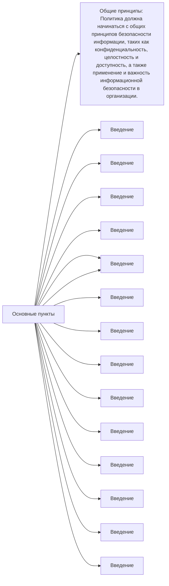

## Задание 2
Политика безопасности является ключевым документом в системе управления информационной безопасностью (СУИБ). В нее включаются принципы и правила, которые организация собирается соблюдать для обеспечения ИБ. Пункты, которые обычно должны быть включены в политику безопасности, исходя из стандарта ИСО/МЭК 27002-2021, включают следующие:
